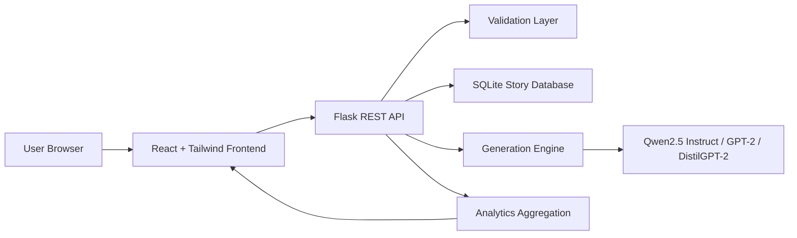

# StoryCraft AI

**Intelligent Story Generation & Completion Platform**

StoryCraft AI is a full-stack story generation and completion application. It uses React, Tailwind CSS, Framer Motion, Recharts, Flask, SQLite, and Hugging Face Transformers with GPT-2 and DistilGPT-2.

## Highlights

- Modern SaaS dashboard with responsive dark/light theme.
- Story generation and unfinished-story completion.
- An instruction-tuned Qwen2.5 option for prompt-focused output, plus GPT-2 and DistilGPT-2 baselines for comparison.
- Adjustable generation controls: temperature, top-k, top-p, and max tokens.
- Model comparison with coherence, creativity, context retention, speed, memory, and length metrics.
- SQLite Story Library with search, filters, editing, deletion, ratings, copy, TXT download, and PDF download.
- Analytics dashboards with Recharts visualizations for trends, genre distribution, model usage, speed, ratings, and story length.
- Flask REST APIs with validation, restricted CORS configuration, safe error responses, and JSON responses.
- Docker and environment configuration.

## Tech Stack

| Layer | Technology |
| --- | --- |
| Frontend | React.js, Tailwind CSS, Framer Motion, Recharts, Lucide Icons |
| Backend | Python Flask, Flask-CORS |
| Generation Engine | Hugging Face Transformers, PyTorch, Qwen2.5 Instruct, GPT-2, DistilGPT-2 |
| Database | SQLite |
| Exports | Clipboard API, TXT download, jsPDF |
| Deployment | Docker, Docker Compose |

## Architecture



## Project Structure

```text
StoryCraft-AI/
+-- app.py
+-- requirements.txt
+-- package.json
+-- docker-compose.yml
+-- Dockerfile
+-- backend/
|   +-- app.py
|   +-- ai_engine.py
|   +-- validation.py
|   +-- utils.py
|   +-- config/
|   +-- database/
|   +-- models/
+-- frontend/
|   +-- package.json
|   +-- index.html
|   +-- src/
|       +-- App.jsx
|       +-- components/
|       +-- services/
|       +-- utils/
+-- tests/
+-- outputs/
```

## Screenshots

Add screenshots after running the app:

- Dashboard
- Story Generator
- Model Comparison
- Story Library
- Analytics

## Installation

## Startup Architecture

StoryCraft AI no longer uses Streamlit. The application is split into two independent processes:

- `python app.py` starts only the Flask REST backend on port `5000`.
- `npm run dev` starts only the React/Vite frontend on port `5173`.

The Flask server is guarded by `if __name__ == "__main__":` and uses `use_reloader=False` to avoid Werkzeug signal handling errors in managed or threaded environments. Do not run this project with `streamlit run app.py`.

### Backend

```powershell
cd C:\Users\Lenovo\Desktop\NLP-Story-Generator
python -m venv .venv
.\.venv\Scripts\Activate.ps1
pip install -r requirements.txt
python app.py
```

Backend URL:

```text
http://127.0.0.1:5000
```

### Frontend

Install Node.js from [nodejs.org](https://nodejs.org/) if `node` and `npm` are not available.

```powershell
cd C:\Users\Lenovo\Desktop\NLP-Story-Generator
npm install
npm run dev
```

Frontend URL:

```text
http://127.0.0.1:5173
```

## Verification

```powershell
.\.venv\Scripts\python.exe -m pytest -q
.\.venv\Scripts\python.exe verify_core.py
```

The first use of a selected model downloads it to `backend/models`. Qwen2.5 0.5B Instruct is the quality-focused default; GPT-2 and DistilGPT-2 remain available for lightweight baseline comparison.

## API Documentation

### `POST /generate-story`

Generates a new story.

```json
{
  "prompt": "A scientist found a forest growing inside a satellite.",
  "genre": "Sci-Fi",
  "model": "qwen2.5-0.5b-instruct",
  "temperature": 0.85,
  "top_k": 50,
  "top_p": 0.92,
  "max_tokens": 180
}
```

### `POST /complete-story`

Continues an unfinished story.

```json
{
  "unfinished_story": "The old key opened every door except one...",
  "genre": "Mystery",
  "model": "gpt2",
  "temperature": 0.8,
  "top_k": 40,
  "top_p": 0.9,
  "max_tokens": 160
}
```

### `POST /compare-models`

Generates side-by-side outputs from GPT-2 and DistilGPT-2.

### `POST /save-story`

Stores generated output in SQLite.

### `GET /get-stories`

Returns saved stories. Supports:

```text
search, genre, model, min_rating
```

### `PUT /update-story/<id>`

Updates a saved story title and body.

### `DELETE /delete-story/<id>`

Deletes a saved story.

### `POST /rate-story`

Rates a story from 1 to 5 stars.

### `GET /get-analytics`

Returns dashboard, analytics, genre, rating, model, and performance data.

## Database Schema

The `stories` table stores:

- ID
- Title
- Prompt
- Genre
- Generated Story
- Original Text
- Continuation
- Combined Story
- Summary
- Model Used
- Timestamp
- Rating
- Word Count
- Reading Time
- Generation Time
- Temperature
- Top-K
- Top-P
- Max Tokens
- Mode

## Docker

```powershell
docker compose up --build
```

Backend:

```text
http://127.0.0.1:5000
```

Frontend:

```text
http://127.0.0.1:5173
```

## Future Enhancements

- Add user authentication and personal workspaces.
- Add semantic similarity scoring using sentence embeddings.
- Add PDF report generation for model experiments.
- Add cloud deployment with a managed database and model inference endpoint.
